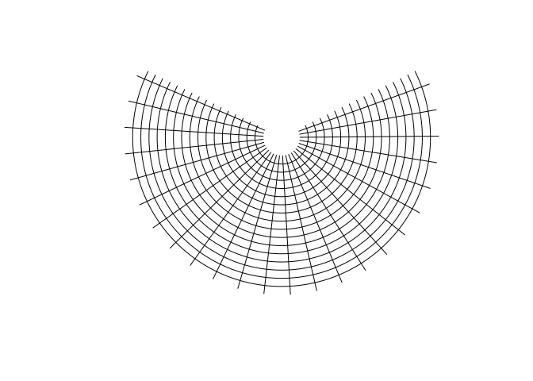

<!-- README.md is generated from README.Rmd. Please edit that file -->

# llbox

<!-- badges: start -->
<!-- badges: end -->

The goal of llbox is to … have control over building graticules.

There are simple cases … we can do curvature analysis (see tissot) for
more complex ones, or segment subdivision ala D3.

This is how to make tiles. Do the start and end edge of a series of
longitudes and latitudes.

``` r
library(llbox)
devtools::load_all()
#> ℹ Loading llbox
#system.time({
to_sf <- function(x) {
  #sfheaders::sfc_polygon(polygonate(x))
  sf::st_sfc(sf::st_polygon(list(polygonate(x))), crs = "OGC:CRS84")
}
proj <- "+proj=murd3 +lat_1=30 +lat_2=50"
# proj <- "+proj=tobmerc"
# proj <- "+proj=laea"
# proj <- "+proj=peirce_q"
gridx <- seq(-180, 180, by = 10)
gridy <- seq(-50, 90, by = 15)
x0 <- list()
revm <- function(x) {
  x[seq(nrow(x), 1), ]
}
nv <- 180
for (i in seq_along(head(gridx, -1))) {
  for (j in seq_along(head(gridy, -1))) {
    ww <- west(x = gridx[i], y = gridy[j + c(0, 1)], nverts = nv)
    nn <- north(x = gridx[i + c(0, 1)], y = gridy[j + 1], nverts = nv)
    ee <- revm(east(x = gridx[i + 1], y = gridy[j + c(0, 1)], nverts = nv))
    ss <- revm(south(x = gridx[i + c(0, 1)], y = gridy[j], nverts = nv))
    x0  <- c(x0, list(rbind(ww, nn, ee, ss)))

  }
}

sfx <- sf::st_transform(do.call(c, lapply(x0, to_sf)), proj)
#})
plot(sfx)
```


This is how to make lines.

``` r
xs <- seq(-175, 175, by = 15)
ys <- seq(-75, 75, by = 10)
meridians <- lapply(xs, \(x) west(x, c(-85, 85)))
parallels <- lapply(ys, \(x) north(c(-180, 180), x, nverts = 120))
to_sfl <- function(x) {
  sf::st_sfc(sf::st_linestring(x), crs = "OGC:CRS84")
}
sfx <- sf::st_transform(do.call(c, lapply(c(meridians, parallels), to_sfl)), proj)
plot(sfx)
```



## Code of Conduct

Please note that the llbox project is released with a [Contributor Code
of
Conduct](https://contributor-covenant.org/version/2/0/CODE_OF_CONDUCT.html).
By contributing to this project, you agree to abide by its terms.
